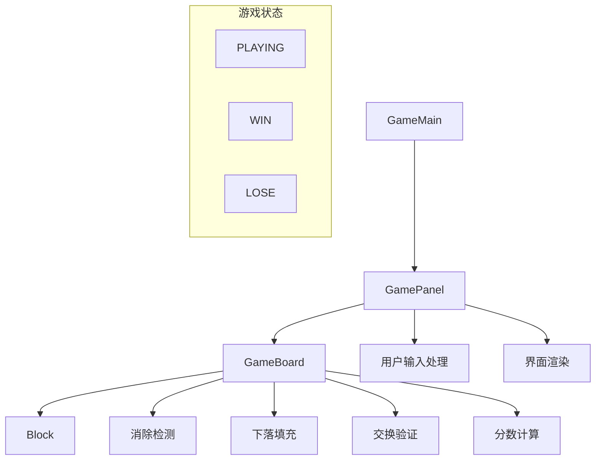
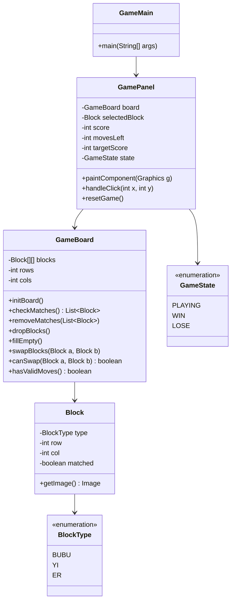
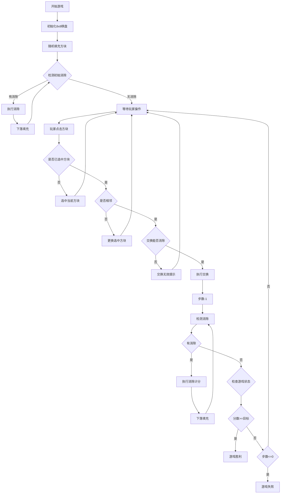

# 布布一二消消乐 - 项目设计文档

## 1. 系统架构

## 2. 类图

## 3. 游戏流程

## 4. 核心算法

### 4.1 消除检测
- 横向遍历：检测每行连续相同方块
- 纵向遍历：检测每列连续相同方块
- 标记所有需要消除的方块

### 4.2 分数计算
| 消除数量 | 得分 |
|---------|------|
| 3个 | 10分 |
| 4个 | 20分 |
| 5个及以上 | 30分 |

### 4.3 下落填充
1. 从底部向上遍历每列
2. 遇到空位，上方方块下落
3. 顶部空位填充随机新方块

## 5. UI/UX 规范

### 5.1 颜色方案
- 背景色：#2C3E50 (深蓝灰)
- 棋盘背景：#34495E (浅蓝灰)
- 格子边框：#1ABC9C (青绿)
- 选中高亮：#F39C12 (橙黄)
- 文字颜色：#ECF0F1 (浅灰白)
- 胜利提示：#27AE60 (绿色)
- 失败提示：#E74C3C (红色)

### 5.2 尺寸规范
- 窗口大小：700 x 800
- 棋盘偏移：(50, 100)
- 格子大小：70 x 70
- 格子间距：2px
- 图片大小：60 x 60

### 5.3 字体
- 标题：微软雅黑 Bold 28px
- 信息：微软雅黑 20px
- 状态：微软雅黑 Bold 36px
