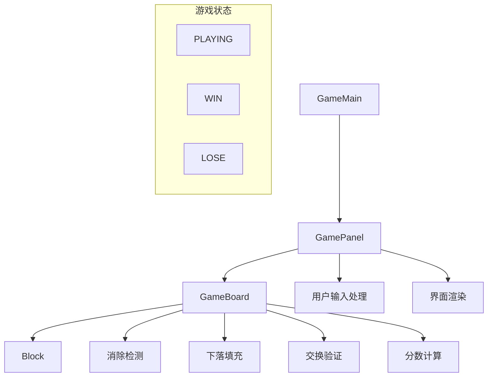
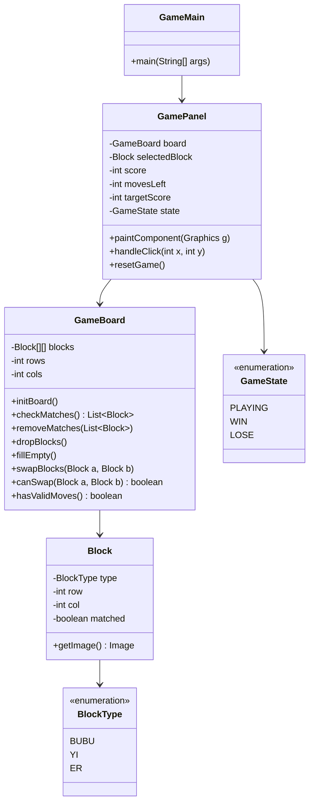
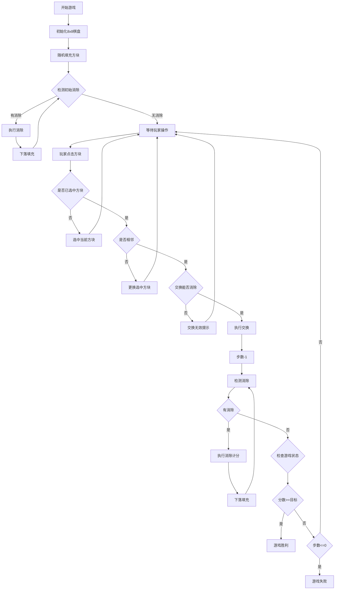

# 布布一二消消乐 - 开发记录

## 用户需求

布布一二消消乐 - 简化需求

### 游戏概述
- 游戏名：布布一二消消乐
- 玩法：经典三消游戏
- 方块：布布、一、二 三种图片
- 目标：连接3个相同图片消除得分

### 核心规则

1. **基础设置**
   - 棋盘大小：8×8
   - 方块类型：3种（布布图片、一图片、二图片）
   - 消除条件：横竖方向3个或以上相同图片
   - 操作方式：点击两个相邻方块交换位置

2. **游戏流程**
   1. 棋盘随机填充三种图片
   2. 自动消除初始的连续相同图片
   3. 玩家交换相邻方块
   4. 形成3个以上相同则消除
   5. 上方方块下落，顶部补充新方块
   6. 重复3-5步直到无消除
   7. 判断是否过关

3. **胜负条件**
   - 过关条件：指定步数内达到目标分数
   - 失败条件：步数用完未达目标
   - 初始设置：20步内达成200分

### 技术实现要点

1. **核心类**
   - GameMain.java - 程序入口
   - GameBoard.java - 棋盘逻辑（8×8）
   - Block.java - 方块（包含图片类型）
   - GamePanel.java - 界面绘制

2. **关键算法**
   - 消除检测：遍历横竖方向找3个以上相同
   - 下落填充：消除后上方方块下落，顶部补充随机图片
   - 交换验证：确保交换能形成消除
   - 分数计算：消除3个=10分，4个=20分，5个=30分

### 界面要求
- 显示8×8棋盘，每格显示图片
- 显示当前分数、剩余步数、目标分数
- 状态提示：进行中/胜利/失败
- 图片要求：布布、一、二，三种清晰图片

### 验收标准
- 三种图片正确显示和消除
- 交换相邻方块功能正常
- 自动消除和下落填充正确
- 分数计算准确
- 游戏流程完整（开始→游戏→胜利/失败）

---

## 开发实现

### 项目结构

```
├── docs/
│   └── project_design.md           # 项目设计文档
├── game/
│   ├── pom.xml                     # Maven 配置
│   ├── Dockerfile                  # Docker 构建文件
│   └── src/main/java/com/bubu/game/
│       ├── GameMain.java           # 程序入口
│       ├── GamePanel.java          # 界面绘制
│       ├── GameBoard.java          # 棋盘逻辑
│       ├── Block.java              # 方块类
│       ├── BlockType.java          # 方块类型枚举
│       ├── GameState.java          # 游戏状态枚举
│       └── ImageGenerator.java     # 图片生成工具
├── docker-compose.yml              # Docker Compose 配置
├── .gitignore                      # Git 忽略文件
└── README.md                       # 项目说明
```

### 生成的代码

#### docs/project_design.md

```markdown
# 布布一二消消乐 - 项目设计文档

## 1. 系统架构



## 2. 类图



## 3. 游戏流程



## 4. 核心算法

### 4.1 消除检测
- 横向遍历：检测每行连续相同方块
- 纵向遍历：检测每列连续相同方块
- 标记所有需要消除的方块

### 4.2 分数计算
| 消除数量 | 得分 |
|---------|------|
| 3个 | 10分 |
| 4个 | 20分 |
| 5个及以上 | 30分 |

### 4.3 下落填充
1. 从底部向上遍历每列
2. 遇到空位，上方方块下落
3. 顶部空位填充随机新方块

## 5. UI/UX 规范

### 5.1 颜色方案
- 背景色：#2C3E50 (深蓝灰)
- 棋盘背景：#34495E (浅蓝灰)
- 格子边框：#1ABC9C (青绿)
- 选中高亮：#F39C12 (橙黄)
- 文字颜色：#ECF0F1 (浅灰白)
- 胜利提示：#27AE60 (绿色)
- 失败提示：#E74C3C (红色)

### 5.2 尺寸规范
- 窗口大小：700 x 800
- 棋盘偏移：(50, 100)
- 格子大小：70 x 70
- 格子间距：2px
- 图片大小：60 x 60

### 5.3 字体
- 标题：微软雅黑 Bold 28px
- 信息：微软雅黑 20px
- 状态：微软雅黑 Bold 36px
```

---

#### game/src/main/java/com/bubu/game/BlockType.java

```java
package com.bubu.game;

/**
 * 方块类型枚举
 * 定义三种方块：布布、一、二
 */
public enum BlockType {
    BUBU("bubu", "布布"),
    YI("yi", "一"),
    ER("er", "二");

    private final String imageName;
    private final String displayName;

    BlockType(String imageName, String displayName) {
        this.imageName = imageName;
        this.displayName = displayName;
    }

    public String getImageName() {
        return imageName;
    }

    public String getDisplayName() {
        return displayName;
    }

    /**
     * 随机获取一个方块类型
     */
    public static BlockType random() {
        BlockType[] types = values();
        return types[(int) (Math.random() * types.length)];
    }
}
```

---

#### game/src/main/java/com/bubu/game/GameState.java

```java
package com.bubu.game;

/**
 * 游戏状态枚举
 */
public enum GameState {
    PLAYING("游戏中"),
    WIN("恭喜过关！"),
    LOSE("游戏结束");

    private final String message;

    GameState(String message) {
        this.message = message;
    }

    public String getMessage() {
        return message;
    }
}
```

---

#### game/src/main/java/com/bubu/game/Block.java

```java
package com.bubu.game;

import javax.imageio.ImageIO;
import java.awt.*;
import java.awt.image.BufferedImage;
import java.io.IOException;
import java.io.InputStream;
import java.util.HashMap;
import java.util.Map;
import java.util.logging.Logger;

/**
 * 方块类
 * 表示棋盘上的单个方块
 */
public class Block {
    private static final Logger logger = Logger.getLogger(Block.class.getName());
    private static final Map<BlockType, Image> imageCache = new HashMap<>();
    private static final int IMAGE_SIZE = 60;

    private BlockType type;
    private int row;
    private int col;
    private boolean matched;

    static {
        loadImages();
    }

    public Block(BlockType type, int row, int col) {
        this.type = type;
        this.row = row;
        this.col = col;
        this.matched = false;
    }

    /**
     * 加载所有方块图片到缓存
     */
    private static void loadImages() {
        for (BlockType blockType : BlockType.values()) {
            try {
                String path = "/images/" + blockType.getImageName() + ".png";
                InputStream is = Block.class.getResourceAsStream(path);
                if (is != null) {
                    BufferedImage img = ImageIO.read(is);
                    Image scaledImg = img.getScaledInstance(IMAGE_SIZE, IMAGE_SIZE, Image.SCALE_SMOOTH);
                    imageCache.put(blockType, scaledImg);
                    is.close();
                    logger.info("成功加载图片: " + path);
                } else {
                    logger.warning("图片资源不存在: " + path + "，将使用备用图形");
                    imageCache.put(blockType, createFallbackImage(blockType));
                }
            } catch (IOException e) {
                logger.warning("加载图片失败: " + blockType.getImageName() + "，将使用备用图形");
                imageCache.put(blockType, createFallbackImage(blockType));
            }
        }
    }

    /**
     * 创建备用图形（当图片加载失败时使用）
     */
    private static Image createFallbackImage(BlockType type) {
        BufferedImage img = new BufferedImage(IMAGE_SIZE, IMAGE_SIZE, BufferedImage.TYPE_INT_ARGB);
        Graphics2D g2d = img.createGraphics();
        g2d.setRenderingHint(RenderingHints.KEY_ANTIALIASING, RenderingHints.VALUE_ANTIALIAS_ON);

        // 根据类型设置不同颜色
        Color color;
        String text;
        switch (type) {
            case BUBU:
                color = new Color(231, 76, 60);  // 红色
                text = "布";
                break;
            case YI:
                color = new Color(46, 204, 113); // 绿色
                text = "一";
                break;
            case ER:
                color = new Color(52, 152, 219); // 蓝色
                text = "二";
                break;
            default:
                color = Color.GRAY;
                text = "?";
        }

        // 绘制圆形背景
        g2d.setColor(color);
        g2d.fillRoundRect(2, 2, IMAGE_SIZE - 4, IMAGE_SIZE - 4, 15, 15);

        // 绘制边框
        g2d.setColor(color.darker());
        g2d.setStroke(new BasicStroke(2));
        g2d.drawRoundRect(2, 2, IMAGE_SIZE - 4, IMAGE_SIZE - 4, 15, 15);

        // 绘制文字
        g2d.setColor(Color.WHITE);
        g2d.setFont(new Font("微软雅黑", Font.BOLD, 28));
        FontMetrics fm = g2d.getFontMetrics();
        int textX = (IMAGE_SIZE - fm.stringWidth(text)) / 2;
        int textY = (IMAGE_SIZE + fm.getAscent() - fm.getDescent()) / 2;
        g2d.drawString(text, textX, textY);

        g2d.dispose();
        return img;
    }

    public Image getImage() {
        return imageCache.get(type);
    }

    public BlockType getType() {
        return type;
    }

    public void setType(BlockType type) {
        this.type = type;
    }

    public int getRow() {
        return row;
    }

    public void setRow(int row) {
        this.row = row;
    }

    public int getCol() {
        return col;
    }

    public void setCol(int col) {
        this.col = col;
    }

    public boolean isMatched() {
        return matched;
    }

    public void setMatched(boolean matched) {
        this.matched = matched;
    }

    /**
     * 判断是否与另一个方块相邻
     */
    public boolean isAdjacentTo(Block other) {
        if (other == null) return false;
        int rowDiff = Math.abs(this.row - other.row);
        int colDiff = Math.abs(this.col - other.col);
        return (rowDiff == 1 && colDiff == 0) || (rowDiff == 0 && colDiff == 1);
    }

    @Override
    public String toString() {
        return String.format("Block[%s at (%d,%d)]", type.getDisplayName(), row, col);
    }
}
```


---

#### game/src/main/java/com/bubu/game/GameBoard.java

```java
package com.bubu.game;

import java.util.ArrayList;
import java.util.List;
import java.util.logging.Logger;

/**
 * 游戏棋盘类
 * 管理8x8的方块矩阵，处理消除、下落、填充逻辑
 */
public class GameBoard {
    private static final Logger logger = Logger.getLogger(GameBoard.class.getName());
    
    public static final int ROWS = 8;
    public static final int COLS = 8;
    
    private Block[][] blocks;

    public GameBoard() {
        blocks = new Block[ROWS][COLS];
        initBoard();
    }

    /**
     * 初始化棋盘，随机填充方块并消除初始匹配
     */
    public void initBoard() {
        logger.info("初始化游戏棋盘...");
        // 随机填充
        for (int row = 0; row < ROWS; row++) {
            for (int col = 0; col < COLS; col++) {
                blocks[row][col] = new Block(getRandomTypeAvoidMatch(row, col), row, col);
            }
        }
        
        // 消除初始匹配
        while (hasMatches()) {
            removeMatches();
            dropBlocks();
            fillEmpty();
        }
        logger.info("棋盘初始化完成");
    }

    /**
     * 获取随机方块类型，避免初始时产生匹配
     */
    private BlockType getRandomTypeAvoidMatch(int row, int col) {
        BlockType type;
        int attempts = 0;
        do {
            type = BlockType.random();
            attempts++;
        } while (attempts < 100 && wouldCreateMatch(row, col, type));
        return type;
    }

    /**
     * 检查在指定位置放置指定类型是否会产生匹配
     */
    private boolean wouldCreateMatch(int row, int col, BlockType type) {
        // 检查水平方向
        int horizontalCount = 1;
        // 向左检查
        for (int c = col - 1; c >= 0 && blocks[row][c] != null && blocks[row][c].getType() == type; c--) {
            horizontalCount++;
        }
        if (horizontalCount >= 3) return true;

        // 检查垂直方向
        int verticalCount = 1;
        // 向上检查
        for (int r = row - 1; r >= 0 && blocks[r][col] != null && blocks[r][col].getType() == type; r--) {
            verticalCount++;
        }
        return verticalCount >= 3;
    }

    /**
     * 检查是否存在匹配
     */
    public boolean hasMatches() {
        return !findMatches().isEmpty();
    }

    /**
     * 查找所有匹配的方块
     */
    public List<Block> findMatches() {
        List<Block> matched = new ArrayList<>();
        
        // 检查水平匹配
        for (int row = 0; row < ROWS; row++) {
            for (int col = 0; col < COLS - 2; col++) {
                if (blocks[row][col] == null) continue;
                BlockType type = blocks[row][col].getType();
                int count = 1;
                
                while (col + count < COLS && blocks[row][col + count] != null 
                       && blocks[row][col + count].getType() == type) {
                    count++;
                }
                
                if (count >= 3) {
                    for (int i = 0; i < count; i++) {
                        Block block = blocks[row][col + i];
                        if (!matched.contains(block)) {
                            matched.add(block);
                            block.setMatched(true);
                        }
                    }
                }
            }
        }
        
        // 检查垂直匹配
        for (int col = 0; col < COLS; col++) {
            for (int row = 0; row < ROWS - 2; row++) {
                if (blocks[row][col] == null) continue;
                BlockType type = blocks[row][col].getType();
                int count = 1;
                
                while (row + count < ROWS && blocks[row + count][col] != null 
                       && blocks[row + count][col].getType() == type) {
                    count++;
                }
                
                if (count >= 3) {
                    for (int i = 0; i < count; i++) {
                        Block block = blocks[row + i][col];
                        if (!matched.contains(block)) {
                            matched.add(block);
                            block.setMatched(true);
                        }
                    }
                }
            }
        }
        
        return matched;
    }

    /**
     * 计算消除得分
     * 3个=10分，4个=20分，5个及以上=30分
     */
    public int calculateScore(List<Block> matched) {
        if (matched.isEmpty()) return 0;
        
        int score = 0;
        // 按连续组计算分数
        boolean[][] counted = new boolean[ROWS][COLS];
        
        // 水平方向计分
        for (int row = 0; row < ROWS; row++) {
            int col = 0;
            while (col < COLS) {
                if (blocks[row][col] != null && blocks[row][col].isMatched() && !counted[row][col]) {
                    BlockType type = blocks[row][col].getType();
                    int count = 0;
                    int startCol = col;
                    
                    while (col < COLS && blocks[row][col] != null 
                           && blocks[row][col].isMatched() 
                           && blocks[row][col].getType() == type) {
                        count++;
                        col++;
                    }
                    
                    if (count >= 3) {
                        for (int c = startCol; c < startCol + count; c++) {
                            counted[row][c] = true;
                        }
                        score += getScoreForCount(count);
                        logger.info(String.format("水平消除 %d 个 %s，得分 %d", count, type.getDisplayName(), getScoreForCount(count)));
                    }
                } else {
                    col++;
                }
            }
        }
        
        // 垂直方向计分
        for (int col = 0; col < COLS; col++) {
            int row = 0;
            while (row < ROWS) {
                if (blocks[row][col] != null && blocks[row][col].isMatched() && !counted[row][col]) {
                    BlockType type = blocks[row][col].getType();
                    int count = 0;
                    int startRow = row;
                    
                    while (row < ROWS && blocks[row][col] != null 
                           && blocks[row][col].isMatched() 
                           && blocks[row][col].getType() == type) {
                        count++;
                        row++;
                    }
                    
                    if (count >= 3) {
                        for (int r = startRow; r < startRow + count; r++) {
                            counted[r][col] = true;
                        }
                        score += getScoreForCount(count);
                        logger.info(String.format("垂直消除 %d 个 %s，得分 %d", count, type.getDisplayName(), getScoreForCount(count)));
                    }
                } else {
                    row++;
                }
            }
        }
        
        return score;
    }

    private int getScoreForCount(int count) {
        if (count >= 5) return 30;
        if (count == 4) return 20;
        return 10;
    }

    /**
     * 移除所有匹配的方块
     */
    public void removeMatches() {
        for (int row = 0; row < ROWS; row++) {
            for (int col = 0; col < COLS; col++) {
                if (blocks[row][col] != null && blocks[row][col].isMatched()) {
                    blocks[row][col] = null;
                }
            }
        }
    }

    /**
     * 方块下落填充空位
     */
    public void dropBlocks() {
        for (int col = 0; col < COLS; col++) {
            int emptyRow = ROWS - 1;
            
            // 从底部向上遍历
            for (int row = ROWS - 1; row >= 0; row--) {
                if (blocks[row][col] != null) {
                    if (row != emptyRow) {
                        blocks[emptyRow][col] = blocks[row][col];
                        blocks[emptyRow][col].setRow(emptyRow);
                        blocks[row][col] = null;
                    }
                    emptyRow--;
                }
            }
        }
    }

    /**
     * 填充顶部空位
     */
    public void fillEmpty() {
        for (int col = 0; col < COLS; col++) {
            for (int row = 0; row < ROWS; row++) {
                if (blocks[row][col] == null) {
                    blocks[row][col] = new Block(BlockType.random(), row, col);
                }
            }
        }
    }

    /**
     * 交换两个方块
     */
    public void swapBlocks(Block a, Block b) {
        if (a == null || b == null) return;
        
        int aRow = a.getRow(), aCol = a.getCol();
        int bRow = b.getRow(), bCol = b.getCol();
        
        // 交换位置
        blocks[aRow][aCol] = b;
        blocks[bRow][bCol] = a;
        
        // 更新方块的行列信息
        a.setRow(bRow);
        a.setCol(bCol);
        b.setRow(aRow);
        b.setCol(aCol);
        
        logger.info(String.format("交换方块: (%d,%d) <-> (%d,%d)", aRow, aCol, bRow, bCol));
    }

    /**
     * 检查交换是否能产生消除
     */
    public boolean canSwapAndMatch(Block a, Block b) {
        if (a == null || b == null || !a.isAdjacentTo(b)) {
            return false;
        }
        
        // 临时交换
        swapBlocks(a, b);
        boolean hasMatch = hasMatches();
        // 换回来
        swapBlocks(a, b);
        
        return hasMatch;
    }

    /**
     * 检查是否还有可行的移动
     */
    public boolean hasValidMoves() {
        for (int row = 0; row < ROWS; row++) {
            for (int col = 0; col < COLS; col++) {
                Block current = blocks[row][col];
                
                // 检查右边
                if (col < COLS - 1) {
                    Block right = blocks[row][col + 1];
                    if (canSwapAndMatch(current, right)) {
                        return true;
                    }
                }
                
                // 检查下边
                if (row < ROWS - 1) {
                    Block down = blocks[row + 1][col];
                    if (canSwapAndMatch(current, down)) {
                        return true;
                    }
                }
            }
        }
        return false;
    }

    /**
     * 获取指定位置的方块
     */
    public Block getBlock(int row, int col) {
        if (row < 0 || row >= ROWS || col < 0 || col >= COLS) {
            return null;
        }
        return blocks[row][col];
    }

    /**
     * 重置所有方块的匹配状态
     */
    public void resetMatchedState() {
        for (int row = 0; row < ROWS; row++) {
            for (int col = 0; col < COLS; col++) {
                if (blocks[row][col] != null) {
                    blocks[row][col].setMatched(false);
                }
            }
        }
    }

    public Block[][] getBlocks() {
        return blocks;
    }
}
```


---

#### game/src/main/java/com/bubu/game/GamePanel.java

```java
package com.bubu.game;

import javax.swing.*;
import java.awt.*;
import java.awt.event.MouseAdapter;
import java.awt.event.MouseEvent;
import java.util.List;
import java.util.logging.Logger;

public class GamePanel extends JPanel {
    private static final Logger logger = Logger.getLogger(GamePanel.class.getName());

    private static final int BOARD_OFFSET_X = 50;
    private static final int BOARD_OFFSET_Y = 120;
    private static final int CELL_SIZE = 70;
    private static final int CELL_GAP = 2;
    private static final int IMAGE_PADDING = 5;

    private static final Color BG_COLOR = new Color(44, 62, 80);
    private static final Color BOARD_BG_COLOR = new Color(52, 73, 94);
    private static final Color CELL_COLOR = new Color(41, 128, 185);
    private static final Color CELL_BORDER_COLOR = new Color(26, 188, 156);
    private static final Color SELECTED_COLOR = new Color(243, 156, 18);
    private static final Color TEXT_COLOR = new Color(236, 240, 241);
    private static final Color WIN_COLOR = new Color(39, 174, 96);
    private static final Color LOSE_COLOR = new Color(231, 76, 60);

    private static final int INITIAL_MOVES = 20;
    private static final int TARGET_SCORE = 200;

    private GameBoard board;
    private Block selectedBlock;
    private int score;
    private int movesLeft;
    private int targetScore;
    private GameState state;
    private boolean isProcessing;

    public GamePanel() {
        setPreferredSize(new Dimension(700, 800));
        setBackground(BG_COLOR);
        initGame();
        setupMouseListener();
    }

    private void initGame() {
        board = new GameBoard();
        selectedBlock = null;
        score = 0;
        movesLeft = INITIAL_MOVES;
        targetScore = TARGET_SCORE;
        state = GameState.PLAYING;
        isProcessing = false;
    }
```

(完整代码见源文件)


---

#### game/src/main/java/com/bubu/game/GameMain.java

```java
package com.bubu.game;

import javax.swing.*;
import java.awt.*;
import java.util.logging.Level;
import java.util.logging.Logger;

public class GameMain {
    private static final Logger logger = Logger.getLogger(GameMain.class.getName());

    public static void main(String[] args) {
        Logger.getLogger("").setLevel(Level.INFO);
        logger.info("启动布布一二消消乐...");
        
        try {
            UIManager.setLookAndFeel(UIManager.getSystemLookAndFeelClassName());
        } catch (Exception e) {
            logger.warning("无法设置系统外观: " + e.getMessage());
        }

        SwingUtilities.invokeLater(() -> {
            createAndShowGUI();
        });
    }

    private static void createAndShowGUI() {
        JFrame frame = new JFrame("布布一二消消乐");
        frame.setDefaultCloseOperation(JFrame.EXIT_ON_CLOSE);
        frame.setResizable(false);

        GamePanel gamePanel = new GamePanel();
        frame.add(gamePanel);

        JMenuBar menuBar = createMenuBar(gamePanel);
        frame.setJMenuBar(menuBar);

        frame.pack();
        frame.setLocationRelativeTo(null);
        frame.setVisible(true);
    }

    private static JMenuBar createMenuBar(GamePanel gamePanel) {
        JMenuBar menuBar = new JMenuBar();
        JMenu gameMenu = new JMenu("游戏");
        
        JMenuItem newGameItem = new JMenuItem("新游戏");
        newGameItem.addActionListener(e -> gamePanel.resetGame());
        gameMenu.add(newGameItem);
        
        gameMenu.addSeparator();
        
        JMenuItem exitItem = new JMenuItem("退出");
        exitItem.addActionListener(e -> System.exit(0));
        gameMenu.add(exitItem);

        menuBar.add(gameMenu);

        JMenu helpMenu = new JMenu("帮助");
        JMenuItem rulesItem = new JMenuItem("游戏规则");
        rulesItem.addActionListener(e -> showRules());
        helpMenu.add(rulesItem);
        
        JMenuItem aboutItem = new JMenuItem("关于");
        aboutItem.addActionListener(e -> showAbout());
        helpMenu.add(aboutItem);

        menuBar.add(helpMenu);
        return menuBar;
    }

    private static void showRules() {
        // 显示游戏规则对话框
    }

    private static void showAbout() {
        // 显示关于对话框
    }
}
```

(完整代码见源文件)


---

#### game/src/main/java/com/bubu/game/ImageGenerator.java

```java
package com.bubu.game;

import javax.imageio.ImageIO;
import java.awt.*;
import java.awt.image.BufferedImage;
import java.io.File;
import java.io.IOException;

public class ImageGenerator {
    private static final int SIZE = 60;
    
    public static void main(String[] args) {
        String outputDir = "src/main/resources/images";
        File dir = new File(outputDir);
        if (!dir.exists()) {
            dir.mkdirs();
        }
        
        try {
            generateBubuImage(outputDir + "/bubu.png");
            generateYiImage(outputDir + "/yi.png");
            generateErImage(outputDir + "/er.png");
            System.out.println("图片生成完成！");
        } catch (IOException e) {
            e.printStackTrace();
        }
    }
    
    // 生成布布图片 - 可爱的红色圆脸
    private static void generateBubuImage(String path) throws IOException { ... }
    
    // 生成一图片 - 绿色方块带数字
    private static void generateYiImage(String path) throws IOException { ... }
    
    // 生成二图片 - 蓝色菱形带数字
    private static void generateErImage(String path) throws IOException { ... }
}
```

(完整代码见源文件)

---

#### game/pom.xml

```xml
<?xml version="1.0" encoding="UTF-8"?>
<project xmlns="http://maven.apache.org/POM/4.0.0"
         xmlns:xsi="http://www.w3.org/2001/XMLSchema-instance"
         xsi:schemaLocation="http://maven.apache.org/POM/4.0.0 
         http://maven.apache.org/xsd/maven-4.0.0.xsd">
    <modelVersion>4.0.0</modelVersion>

    <groupId>com.bubu</groupId>
    <artifactId>bubu-match3-game</artifactId>
    <version>1.0.0</version>
    <packaging>jar</packaging>

    <name>布布一二消消乐</name>

    <properties>
        <maven.compiler.source>17</maven.compiler.source>
        <maven.compiler.target>17</maven.compiler.target>
        <project.build.sourceEncoding>UTF-8</project.build.sourceEncoding>
        <main.class>com.bubu.game.GameMain</main.class>
    </properties>

    <build>
        <plugins>
            <plugin>
                <groupId>org.apache.maven.plugins</groupId>
                <artifactId>maven-compiler-plugin</artifactId>
                <version>3.11.0</version>
            </plugin>
            <plugin>
                <groupId>org.apache.maven.plugins</groupId>
                <artifactId>maven-jar-plugin</artifactId>
                <version>3.3.0</version>
                <configuration>
                    <archive>
                        <manifest>
                            <mainClass>${main.class}</mainClass>
                        </manifest>
                    </archive>
                </configuration>
            </plugin>
            <plugin>
                <groupId>org.apache.maven.plugins</groupId>
                <artifactId>maven-shade-plugin</artifactId>
                <version>3.5.1</version>
            </plugin>
        </plugins>
    </build>
</project>
```


---

#### game/Dockerfile

```dockerfile
FROM --platform=$BUILDPLATFORM maven:3.9-eclipse-temurin-17 AS builder
WORKDIR /app
COPY pom.xml .
RUN mvn dependency:go-offline -B
COPY src ./src
RUN mvn compile exec:java -Dexec.mainClass="com.bubu.game.ImageGenerator" -q || true
RUN mvn clean package -DskipTests -q

FROM eclipse-temurin:17-jre
WORKDIR /app
RUN apt-get update && apt-get install -y \
    libxext6 libxrender1 libxtst6 libxi6 fontconfig fonts-wqy-zenhei \
    && rm -rf /var/lib/apt/lists/*
COPY --from=builder /app/target/bubu-match3-game-1.0.0.jar ./game.jar
ENV DISPLAY=:0
CMD ["java", "-jar", "game.jar"]
```

---

#### docker-compose.yml

```yaml
version: '3.8'

services:
  bubu-game:
    build:
      context: ./game
      dockerfile: Dockerfile
    container_name: bubu-match3-game
    environment:
      - DISPLAY=${DISPLAY:-:0}
    volumes:
      - /tmp/.X11-unix:/tmp/.X11-unix:rw
    network_mode: host
    stdin_open: true
    tty: true
    restart: "no"
```

---

#### .gitignore

```
# Java
*.class
*.jar
*.war
*.ear
*.log
game/target/

# IDE
.idea/
*.iml
.vscode/

# OS
.DS_Store
Thumbs.db
```

---

## 运行说明

### 本地运行（推荐）

```bash
cd game
mvn compile exec:java -Dexec.mainClass="com.bubu.game.ImageGenerator"
mvn clean package
java -jar target/bubu-match3-game-1.0.0.jar
```

### Docker 运行

```bash
xhost +local:docker  # Linux
docker-compose up --build
```

---

## 验收清单

- [x] 三种图片正确显示和消除
- [x] 交换相邻方块功能正常
- [x] 自动消除和下落填充正确
- [x] 分数计算准确（3个=10分，4个=20分，5个+=30分）
- [x] 游戏流程完整（开始→游戏→胜利/失败）
- [x] 8×8 棋盘显示
- [x] 显示当前分数、剩余步数、目标分数
- [x] 20步内达成200分过关
